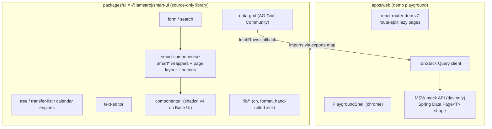
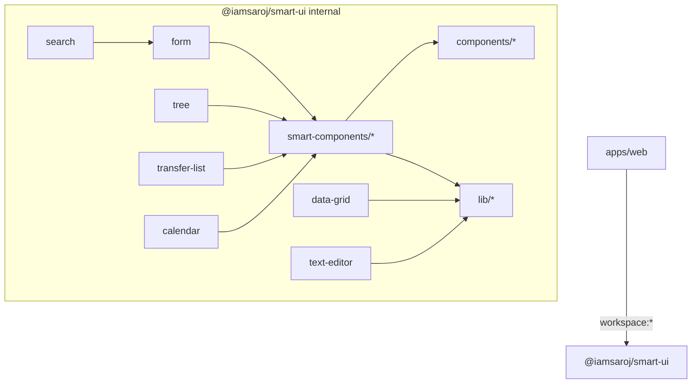
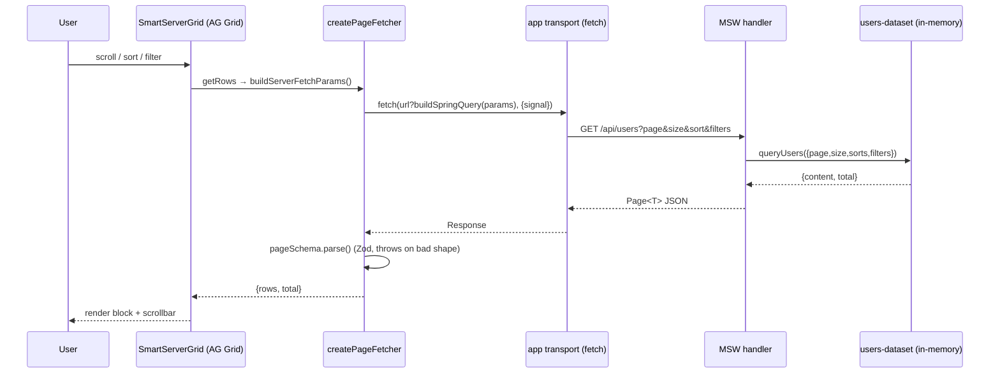
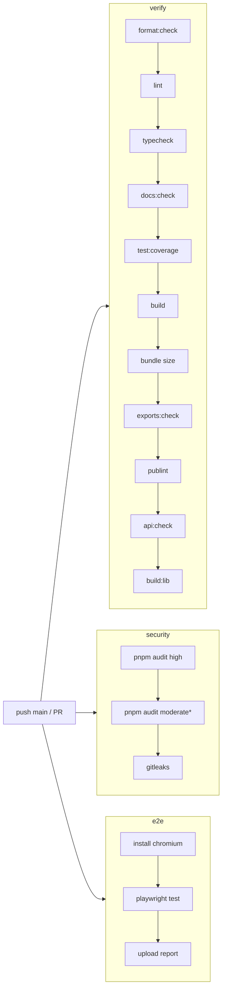
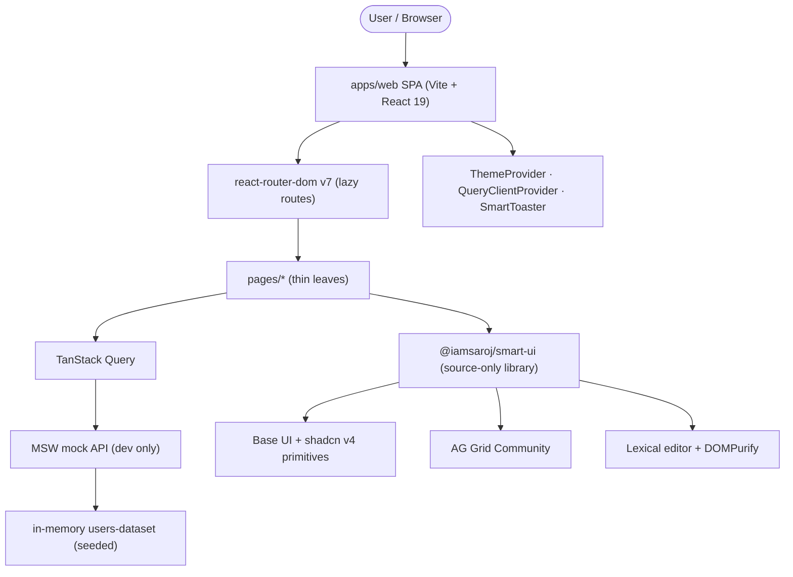
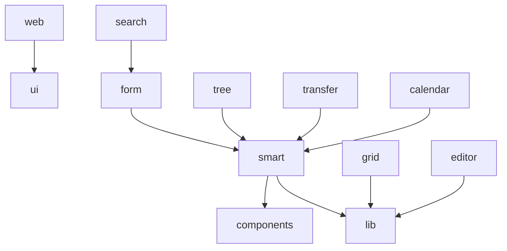
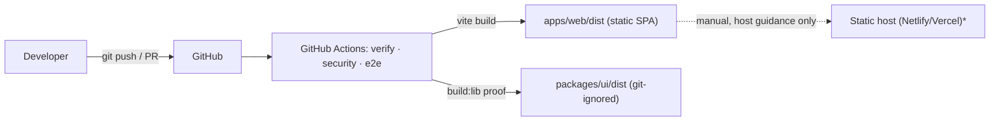
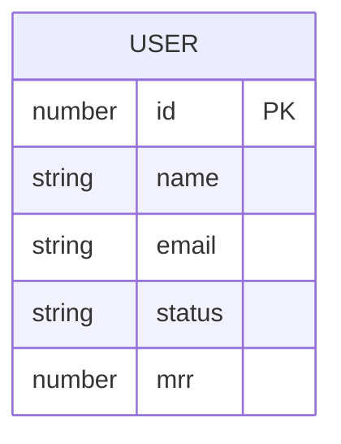
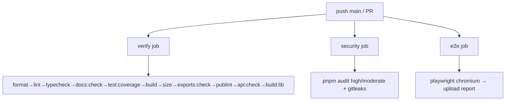
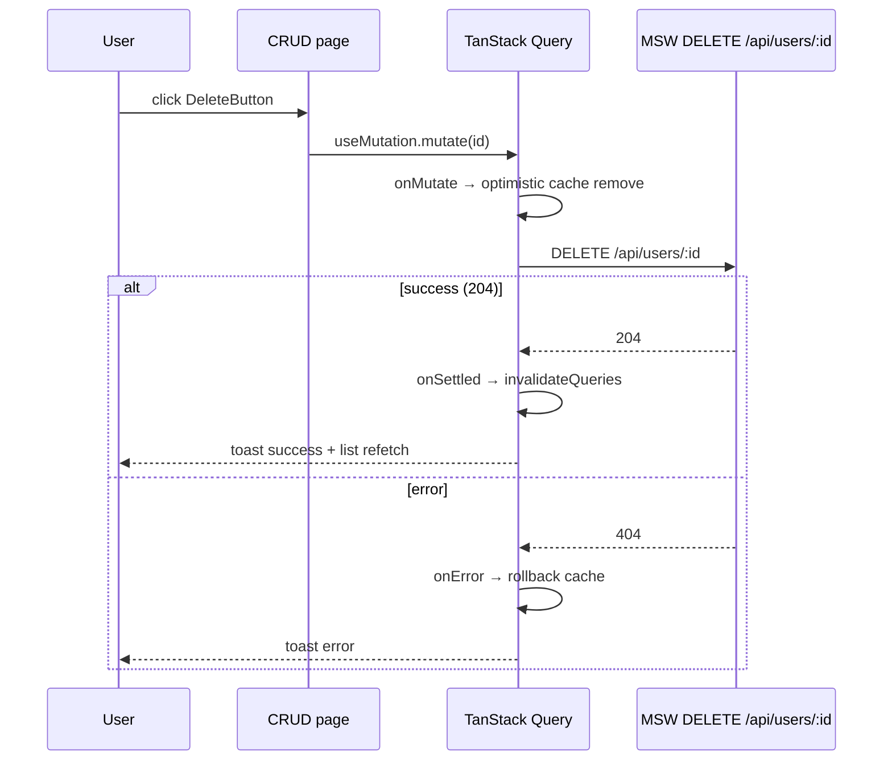

# Architecture

> Generated from the actual source code, configuration, build scripts, and docs in this repository.
> Every statement is grounded in a file that exists in the repo. Where a topic could not be
> verified from the codebase, it is explicitly marked **"Not found in the current codebase."**

## Project overview

**Smart Component** is a **frontend UI component library** delivered as a pnpm + Turborepo
monorepo. It is _not_ a backend service — there is no server, database, or deployed API in this
repository. The "backend" that the demo talks to is an in-browser mock (MSW) that exists only in
dev builds.

The repository contains two workspaces:

| Workspace     | Name                 | Role                                                                                                              |
| ------------- | -------------------- | ----------------------------------------------------------------------------------------------------------------- |
| `packages/ui` | `@iamsaroj/smart-ui` | The shared, reusable React 19 UI library. Source-only (no build step). This is the product.                       |
| `apps/web`    | `web`                | A Vite + React demo/playground that consumes `@iamsaroj/smart-ui` and documents every component with a live page. |

### Purpose

- Provide a large set of **`Smart*` wrapper components** that flatten shadcn/ui + Base UI compound
  primitives into single, config-driven components (cutting JSX boilerplate).
- Ship higher-level **engines**: a declarative form engine (TanStack Form + Zod), a search/filter
  bar, AG Grid data-grid wrappers (client + server row models), a tree engine, a transfer-list
  ("shuttle"), a calendar/booking engine, and a Lexical rich-text editor.
- Keep the library **framework-transport-agnostic** — it never imports a data-fetching client; the
  demo app owns TanStack Query and the MSW mock.

### High-level architecture



### Technology stack

Verified from `package.json` files across the repo.

| Layer                     | Technology                                                                                                                                     | Evidence                                     |
| ------------------------- | ---------------------------------------------------------------------------------------------------------------------------------------------- | -------------------------------------------- |
| Language                  | TypeScript `~6`                                                                                                                                | root/`apps/web`/`packages/ui` `package.json` |
| UI runtime                | React 19 (`^19.2.6`) + React DOM                                                                                                               | both workspaces                              |
| Build (app)               | Vite `^8`, `@vitejs/plugin-react` `^6`                                                                                                         | `apps/web/package.json`, `vite.config.ts`    |
| Styling                   | Tailwind CSS v4, `@tailwindcss/vite`, `tw-animate-css`, `tailwind-merge`, `clsx`, `class-variance-authority`                                   | `packages/ui/package.json`                   |
| Primitives                | Base UI (`@base-ui/react` `^1.6.0`), shadcn v4 style, `cmdk`, `vaul`, `sonner`, `next-themes`, `react-day-picker`, `input-otp`, `lucide-react` | `packages/ui/package.json`                   |
| Forms                     | `@tanstack/react-form`, `@tanstack/react-store`, `zod` v4                                                                                      | `packages/ui/package.json`                   |
| Data grid                 | `ag-grid-community` / `ag-grid-react` `^35.3.1`, `@tanstack/react-table` (vendored primitive only)                                             | `packages/ui/package.json`                   |
| Rich text                 | Lexical `^0.46` (`@lexical/*`), `dompurify`                                                                                                    | `packages/ui/package.json`                   |
| Charts (vendored, unused) | `recharts`, `embla-carousel-react`                                                                                                             | kept deliberately (see ADR/CLAUDE.md)        |
| Fonts                     | `@fontsource-variable/inter`, `@fontsource-variable/noto-serif`                                                                                | `packages/ui/package.json`                   |
| Data fetching (app only)  | `@tanstack/react-query` `^5`, `react-router-dom` `^7`                                                                                          | `apps/web/package.json`                      |
| Mock API                  | `msw` `^2`                                                                                                                                     | `apps/web/package.json`                      |
| Monorepo tooling          | pnpm `10.33.4`, Turborepo `^2.10`, Husky, lint-staged, commitlint, semantic-release, publint                                                   | root `package.json`                          |
| Testing                   | Vitest `^4` (node + jsdom projects), `@vitest/coverage-v8`, Testing Library, Playwright `^1.61`, `@axe-core/playwright`, `axe-core`            | configs below                                |

### Architecture style

This is a **modular, layered component library** organized by **feature domain (vertical slices)**,
consumed by a **route-split single-page application**. It is best described as:

- **Modular monolith (frontend):** one deployable app, internally partitioned into independent
  domain modules (`data-grid`, `form`, `calendar`, …) that are individually
  importable through an `exports` map and have their own tests.
- **Layered within each module:** pure utilities → hooks/state → presentational components →
  flat `Smart*` wrapper (Facade). E.g. `tree-utils.ts` (pure) → `use-tree.ts` (state) →
  `SmartTree` (component).
- **Source-only package (no build step):** the library is distributed as raw `.ts`/`.tsx` source
  through subpath exports; the consuming app compiles it (ADR 0002).

**Why:** the product is a component library, not a service, so there is no request/response server
architecture, no DDD/CQRS domain model, and no persistence layer. The organizing principle is
**reusability and low coupling between UI domains**, which the vertical-slice module layout and the
`exports` contract enforce. There are **no microservices, no event bus, no message queue** — those
concepts do not apply and are **not found in the current codebase.**

---

# Repository Structure

```
/
├─ apps/
│  └─ web/                     # Vite + React 19 demo/playground (private, not published)
│     ├─ src/
│     │  ├─ api/               # Typed transports over the mock API (users, users-crud, users-query)
│     │  ├─ components/        # App chrome: dashboard/ (PlaygroundShell), settings/, theme-provider
│     │  ├─ demo-data/         # Seeded deterministic generators (mulberry32, series) + datasets
│     │  ├─ lib/               # query-client (TanStack Query config)
│     │  ├─ mocks/             # MSW worker: browser.ts, handlers.ts, users-dataset.ts, enable.ts
│     │  ├─ pages/             # Thin leaf route components (grids/, examples/, projects/, smart/, …)
│     │  ├─ styles/            # App-level CSS (fonts.css etc.)
│     │  ├─ App.tsx            # Route table (react-router-dom v7), all pages lazy-loaded
│     │  └─ main.tsx           # Entry: enableMocking() → createRoot → providers
│     ├─ scripts/check-bundle-size.mjs   # Bundle budget gate
│     ├─ index.html
│     └─ vite.config.ts        # manualChunks vendor splitting
├─ packages/
│  └─ ui/  (@iamsaroj/smart-ui)     # The library — source-only, exports map is the public API
│     └─ src/
│        ├─ components/        # 49 shadcn v4 primitives on Base UI (vendored, regenerable)
│        ├─ smart-components/  # Smart* wrappers + page/ layout system + buttons/ presets
│        ├─ form/       # SmartForm (TanStack Form + Zod), Smart*Field controls
│        ├─ search/     # SmartSearchForm — composes form
│        ├─ data-grid/         # SmartGrid / SmartServerGrid (AG Grid Community)
│        ├─ tree/       # SmartTree
│        ├─ transfer-list/  # SmartTransferList
│        ├─ calendar/   # SmartCalendar (+ recurrence, booking)
│        ├─ text-editor/   # SmartTextEditor (+ sanitize contract)
│        ├─ hooks/             # use-mobile
│        ├─ lib/               # cn (utils), format, hand-rolled xlsx writer
│        ├─ styles/            # globals.css (Tailwind v4 entry), fonts.css
│        └─ test-utils/        # a11y (axe) helper
├─ docs/                       # 8 per-domain guides + adr/ (6 ADRs) + component-map + security
├─ scripts/                    # check-docs.mjs, check-exports.mjs (CI gates)
├─ tooling/api-check/          # consume.tsx + tsconfig: type-check every subpath from outside
├─ e2e/                        # 11 Playwright specs
├─ .releaserc.json             # semantic-release config (version + npm publish from main)
├─ .github/workflows/          # ci.yml (verify / security / e2e) + release.yml (semantic-release)
├─ turbo.json                  # Task graph & caching
├─ pnpm-workspace.yaml
└─ CLAUDE.md / CONTRIBUTING.md / README.md / report.md
```

**Major directory responsibilities:**

- **`apps/web`** — the only runnable artifact; a demo, not a production app. Owns routing, data
  fetching, and the mock backend. Depends on `@iamsaroj/smart-ui` via `workspace:*`.
- **`packages/ui`** — the product. No build step; every reusable component lives here.
- **`docs/`** — per-domain usage guides + ADRs; enforced by `scripts/check-docs.mjs` (every export
  subpath must have a guide, and doc snippets must type-check).
- **`tooling/api-check`** — an out-of-tree consumer that imports one symbol from every export
  subpath, type-checked with the app's strict settings, to catch public-surface breaks.
- **`e2e/`** — Playwright smoke suite covering the layer jsdom can't (AG Grid canvas, Base UI
  portals, real network through the service worker).

---

# Module Architecture

Public modules correspond one-to-one with the `exports` map in `packages/ui/package.json`. File
counts are measured (excluding test files).

| Module (export subpath)                       | Responsibility                                 | Key internal components                                                                                                                                                        | Depends on                                    |
| --------------------------------------------- | ---------------------------------------------- | ------------------------------------------------------------------------------------------------------------------------------------------------------------------------------ | --------------------------------------------- |
| `@iamsaroj/smart-ui/lib/*` (4)                | Pure helpers                                   | `cn()` (clsx+tailwind-merge), `format.ts` (currency/compact/percent), `xlsx.ts` (dependency-free OOXML writer)                                                                 | none                                          |
| `@iamsaroj/smart-ui/hooks/*` (1)              | Shared hooks                                   | `use-mobile`                                                                                                                                                                   | react                                         |
| `@iamsaroj/smart-ui/components/*` (49)        | shadcn v4 primitives on Base UI                | button, dialog, select, table, … (incl. vendored-unused: chart, carousel, data-table, menubar, …)                                                                              | `@base-ui/react`, cva                         |
| `@iamsaroj/smart-ui/smart-components/*` (70)  | Flat `Smart*` facades over compound primitives | SmartCard, SmartDialog, SmartSheet, SmartSelect, SmartCombobox, SmartMultiSelect, SmartDatePicker, SmartStepper, SmartToaster, SmartStatCard, …                                | `components/*`                                |
| `@iamsaroj/smart-ui/smart-components/page`    | Compound page-layout system                    | `SmartPage` + named slots via `PageContext`, `SmartPageContainer`                                                                                                              | smart-components                              |
| `@iamsaroj/smart-ui/smart-components/buttons` | Action-button presets                          | `ACTION_BUTTON_CONFIG` (SSOT) → `ActionButton` → 27 presets (`AddButton`, `SaveButton`…), `ActionPermissionProvider`                                                           | smart-components                              |
| `@iamsaroj/smart-ui/form` (29)                | Declarative forms                              | `SmartForm` (TanStack Form + Zod SSOT), `FieldRenderer`, `Smart*Field` controls, `FieldBaseProps<T>`                                                                           | smart-components, `@tanstack/react-form`, zod |
| `@iamsaroj/smart-ui/search` (4)               | Search/filter bar                              | `SmartSearchForm` — composes SmartForm; `buildSearchQuery`, `countActiveFilters`                                                                                               | form                                          |
| `@iamsaroj/smart-ui/data-grid` (12)           | AG Grid wrappers                               | `SmartGrid` (client), `SmartServerGrid` (infinite/server); `pagination.ts`, `create-page-fetcher.ts`, `formula-guard.ts`, `grid-internals.tsx`, `use-server-grid-selection.ts` | ag-grid-community, zod                        |
| `@iamsaroj/smart-ui/tree` (5)                 | Hierarchical tree/explorer                     | `SmartTree` (generic), `tree-utils.ts` (pure algorithms), `use-tree.ts` (Set-backed state)                                                                                     | smart-components                              |
| `@iamsaroj/smart-ui/transfer-list` (4)        | Dual-list shuttle                              | `SmartTransferList`, `transfer-utils.ts`                                                                                                                                       | smart-components                              |
| `@iamsaroj/smart-ui/calendar` (12)            | Calendar & booking                             | `SmartCalendar` (month/week/day/agenda), `recurrence.ts` (RRULE subset), `booking.ts`, `event-color.ts`, `layoutDayEvents`                                                     | date-fns, smart-components                    |
| `@iamsaroj/smart-ui/text-editor` (19)         | Rich-text editor                               | `SmartTextEditor`, `sanitize.ts` (`sanitizeEditorHtml`/`SafeEditorHtml`), `editorNodes`, `editorTheme`, `plugins/`                                                             | `@lexical/*`, dompurify                       |
| `@iamsaroj/smart-ui/globals.css`              | Tailwind v4 entry (asset)                      | `@source` directives scanning both workspaces                                                                                                                                  | Tailwind v4                                   |

**Exposed APIs:** consumers import only via the 14 declared subpaths. Barrels (`index.ts`) hide
internal files — e.g. `data-grid/pagination.ts` is not individually importable. This is verified in
CI by `scripts/check-exports.mjs` and `tooling/api-check`.

**Generic `forwardRef` components** (`SmartServerGrid`, `SmartTree`, `SmartTransferList`,
`SmartCalendar`) are re-cast after `forwardRef` to restore erased generics — intentional
(documented in CLAUDE.md and code comments).

---

# Layer Architecture

There is no server request/response stack. The layering is **within the frontend**:

```
Route (react-router-dom lazy page)          ← apps/web/src/pages/*
        ↓
App chrome / providers                       ← PlaygroundShell, ThemeProvider, QueryClientProvider
        ↓
Flat facade component (Smart* wrapper)       ← smart-components/*, engines' Smart* entry
        ↓
State hook (Set-backed / controllable)       ← use-tree.ts, use-calendar.ts, use-server-grid-selection.ts
        ↓
Presentational primitive (shadcn / Base UI)  ← components/*
        ↓
Pure utility (framework-agnostic)            ← tree-utils, calendar-utils, pagination, format, xlsx
        ↓
Transport (app-owned)                        ← apps/web/src/api/* → TanStack Query → MSW/fetch
```

| Layer                 | Responsibility                                                                                                                          |
| --------------------- | --------------------------------------------------------------------------------------------------------------------------------------- |
| **Route/page**        | Thin leaf components; no shared state; one per URL (`/section/page`).                                                                   |
| **Chrome/providers**  | Sidebar+breadcrumb shell, theme, query client, toaster mounted once.                                                                    |
| **Facade (`Smart*`)** | Collapse compound primitives into one config-driven component (Facade pattern).                                                         |
| **State hook**        | Controllable/uncontrolled state (`useControllable`, `useIdSet`); Set is the source of truth for selection so it survives block reloads. |
| **Primitive**         | Accessible Base UI building blocks (shadcn v4 render-prop style).                                                                       |
| **Pure utility**      | Deterministic, unit-tested algorithms with no React/DOM dependency.                                                                     |
| **Transport**         | Only in `apps/web`; the library never fetches.                                                                                          |

---

# Request Lifecycle

Two meaningful flows exist: a **client-side navigation** and a **server-grid / CRUD data fetch**.
There is no reverse proxy, controller, or database in this repo — the "server" is MSW in the browser.

**A. Data-grid / CRUD data flow (server row model):**

```
User interacts with SmartServerGrid (scroll / sort / filter)
        ↓
AG Grid Infinite Row Model → getRows(IGetRowsParams)
        ↓
buildServerFetchParams()  →  normalized ServerFetchParams (page, pageSize, sort[], filters[])
        ↓
fetchRows = createPageFetcher({ url, itemSchema, encodeQuery })
        ↓
buildSpringQuery(params)  →  ?page=0&size=20&sort=name,asc&name=contains:ada
        ↓
fetch(url?query, { signal })          ← app transport (apps/web/src/api/users.ts)
        ↓
MSW handler GET /api/users            ← dev-only service worker (apps/web/src/mocks/handlers.ts)
        ↓
queryUsers() over in-memory dataset → Spring Data Page<T> JSON envelope
        ↓
response.ok? → pageSchema(itemSchema).parse(json)   ← Zod validation, fails loud
        ↓
{ rows, total } → AG Grid renders block; total drives the scrollbar
```

**B. CRUD mutation flow (reference: `crud-example-page.tsx`):**

```
Form submit / delete click
        ↓
TanStack Query useMutation (api/users-crud.ts)
        ↓  optimistic delete: onMutate cache edit → onError rollback → onSettled invalidateQueries
MSW POST/PUT/DELETE /api/users[/:id]  ← mutates in-memory users-dataset.ts
        ↓
toast feedback (SmartToaster) + list refetch
```

---

# Dependency Graph



**Coupling analysis:**

- **`search → form`** is the strongest intentional coupling: `SmartSearchForm`
  _composes_ (does not fork) `SmartForm`, reusing its fields, Zod validation, and layout. This is a
  deliberate low-duplication choice (`SearchFieldDefinition` is derived, not copied).
- **`form → smart-components`** — the form renders `Smart*Field` controls.
- Everything UI-facing depends on **`components/*`** (Base UI primitives) and **`lib/*`** (`cn`).
- The **engines are otherwise mutually independent** — `data-grid`, `tree`,
  `calendar`, etc. do not import each other. Low inter-module coupling is the design goal and
  is largely achieved.
- **`apps/web` is the only consumer** and depends on the library through the `exports` map only
  (never reaching into arbitrary files) — enforced by `check-exports.mjs`.

---

# Database Architecture

**No real database exists in this repository.** — the product is a frontend library.

The only "data store" is an **in-memory, mutable, deterministically-seeded table** used by the demo:

- `apps/web/src/mocks/users-dataset.ts` — a mutable in-memory array seeded with `mulberry32`;
  `queryUsers` / `insertUser` / `patchUser` / `removeUser` provide CRUD over it. State resets on
  page reload.
- The response contract it emulates is **Spring Data `Page<T>`** (`content`, `totalElements`,
  `totalPages`, `number`, `size`, `pageable`, …), validated client-side by `pageSchema` (Zod) in
  `packages/ui/src/data-grid/pagination.ts`.

There is **no ORM, no SQL, no migrations, no transactions, and no indexes** in the codebase. The
library ships a Zod-based _contract_ (`pageSchema`, `SPageResponse<T>`, `toSpringSort`,
`buildSpringQuery`) intended for a real Spring Data backend that lives outside this repo — the
matching query _decoder_ is intentionally left app/server-side.

> Real database, ORM, migrations: **Not found in the current codebase.**

---

# API Architecture

The library is **transport-agnostic**; the demo defines one REST-style resource against MSW.

**Style:** REST over `fetch`. No GraphQL, gRPC, or WebSocket. Message queue: **Not found.**

| Endpoint (MSW handler)  | Purpose                                                                                         |
| ----------------------- | ----------------------------------------------------------------------------------------------- |
| `GET /api/users`        | Paged/sorted/filtered list → Spring Data `Page<T>`; supports `?simulateError=1` (HTTP 500 demo) |
| `POST /api/users`       | Create (201)                                                                                    |
| `PUT /api/users/:id`    | Update (404 if missing)                                                                         |
| `DELETE /api/users/:id` | Delete (204 / 404)                                                                              |

- **Routing:** `react-router-dom` v7 in `App.tsx`; routes `/section/page`; every page lazy-loaded
  via `React.lazy` under one `<Suspense fallback={<SmartPageLoading />}>`.
- **Versioning:** none (single demo API). **Not found in the current codebase.**
- **Validation:** Zod v4 everywhere — `pageSchema(itemSchema).parse()` on every paged response;
  request query parsed by `parseUsersQuery` (`api/users-query.ts`); form input validated by the
  form engine's Zod schema (single source of truth for validation _and_ required-ness).
- **Serialization:** JSON. Sort encoded Spring-style (`sort=field,dir`); filters encoded
  `<field>=<op>:<value>` by `encodeSpringFilter`/`buildSpringQuery`.
- **Pagination:** zero-based `page`/`size`; total from `totalElements`.
- **Filtering/sorting:** AG Grid `filterModel`/`sortModel` → normalized `ServerFilter[]`/`ServerSort[]`
  via `buildServerFetchParams` → transport query.
- **Error handling:** `createPageFetcher` checks `response.ok`, throws a mapped `Error`
  (overridable via `mapError`); the grid surfaces the failure; CRUD page uses optimistic update +
  rollback + toast.



---

# Authentication

**No authentication exists in this repository.** There is no login flow, JWT, session, OAuth, SSO,
or API-key handling. The MSW mock endpoints are unauthenticated.

The **only auth-adjacent concept** is a client-side **permission gate for UI**, not identity:

- `smart-components/buttons` provides `ActionPermissionProvider` + optional permission gating so an
  `ActionButton` (e.g. `DeleteButton`) can be hidden/disabled by a caller-supplied permission set.
  This is presentation-layer authorization only — it makes no server call and enforces nothing on a
  backend.

> Login / JWT / OAuth / SSO / RBAC server model: **Not found in the current codebase.**

---

# Authorization

- **UI-level only:** `ActionPermissionProvider` (action-button presets) conditionally renders/gates
  action buttons by permission keys supplied by the host. There is no server-enforced RBAC, no
  role/permission database, and no middleware.

> Server-side authorization / RBAC: **Not found in the current codebase.**

---

# Security

Security work is documented in `docs/security.md` and ADR-adjacent notes; the concrete controls in
the code:

| Concern                           | Status in repo                                                                                                                                                                                                                                                                                                                                                                |
| --------------------------------- | ----------------------------------------------------------------------------------------------------------------------------------------------------------------------------------------------------------------------------------------------------------------------------------------------------------------------------------------------------------------------------- |
| **XSS (stored)**                  | Handled. `text-editor/sanitize.ts`: `sanitizeEditorHtml` runs DOMPurify with an allow-list scoped to exactly the editor's node set; inbound HTML is sanitized on parse; `SafeEditorHtml` is the **only** sanctioned `dangerouslySetInnerHTML` site. Links hardened to `rel="noopener noreferrer nofollow"` + `target="_blank"`; `javascript:`/non-image `data:` URLs dropped. |
| **CSV/XLSX formula injection**    | Handled. `data-grid/formula-guard.ts` neutralizes leading `= + - @` in CSV `processCellCallback` and `collectGridExport` (Excel export).                                                                                                                                                                                                                                      |
| **Dependency vulnerabilities**    | CI `security` job: `pnpm audit --prod --audit-level high` (fails build) + moderate (non-blocking); `.github/dependabot.yml`.                                                                                                                                                                                                                                                  |
| **Secret scanning**               | CI: `gitleaks/gitleaks-action@v2` over full history (`fetch-depth: 0`).                                                                                                                                                                                                                                                                                                       |
| **CSP / security headers**        | Documented (not enforced in-app): `docs/security.md` provides CSP/header guidance + Netlify/Vercel snippets. It is host/deploy config, not app code.                                                                                                                                                                                                                          |
| **CSRF**                          | Not applicable — no cookie-authenticated backend in this repo. **Not found in the current codebase.**                                                                                                                                                                                                                                                                         |
| **SQL injection**                 | Not applicable — no SQL/database. **Not found in the current codebase.**                                                                                                                                                                                                                                                                                                      |
| **CORS**                          | Not applicable — MSW intercepts in-browser. **Not found in the current codebase.**                                                                                                                                                                                                                                                                                            |
| **Encryption / password storage** | Not applicable — no auth or persistence. **Not found in the current codebase.**                                                                                                                                                                                                                                                                                               |
| **Secrets management**            | No secrets in code (verified by gitleaks gate). Only CI secret used is the default `GITHUB_TOKEN`.                                                                                                                                                                                                                                                                            |

---

# Configuration

| Mechanism                  | Where                                                            | Notes                                                                                 |
| -------------------------- | ---------------------------------------------------------------- | ------------------------------------------------------------------------------------- |
| **`import.meta.env.DEV`**  | `apps/web/src/mocks/enable.ts`                                   | Gates MSW startup — mock API is **dev-only**, no-op in prod.                          |
| **`process.env.NODE_ENV`** | `packages/ui/src/data-grid/grid-internals.tsx`                   | AG Grid `ValidationModule` registered only when `!== "production"` (dev-only weight). |
| **`process.env.CI`**       | `playwright.config.ts`                                           | Toggles retries (2), workers (2), reporter, `forbidOnly`, `reuseExistingServer`.      |
| **Vite config**            | `apps/web/vite.config.ts`                                        | `@` alias → `src`; `manualChunks` vendor splitting.                                   |
| **Turbo config**           | `turbo.json`                                                     | Task graph, caching, outputs.                                                         |
| **TS config**              | root/workspace `tsconfig*.json`; `tsconfig.lib.json` (build:lib) | `moduleResolution: bundler`; strict.                                                  |
| **semantic-release**       | `.releaserc.json`                                                | Versions + publishes `@iamsaroj/smart-ui` from conventional commits on `main`.        |

- **`.env` files:** referenced as a cache input in `turbo.json` (`".env*"`) but **no committed
  `.env` file exists**. There is no config server and no runtime feature-flag system.

> `application.yml` / config server / feature flags: **Not found in the current codebase.**

---

# Infrastructure

**There is no deployment infrastructure in this repository.**

- No `Dockerfile`, no `docker-compose`, no Kubernetes/Helm manifests, no Terraform, no Ingress, no
  reverse proxy, no load balancer, no cloud provider config.
- The only build output is a static SPA (`apps/web` → `dist/`) plus an optional proof-build of the
  library (`packages/ui/dist` from `build:lib`, git-ignored).
- Deployment is documented only as guidance: `docs/security.md` includes **Netlify/Vercel** header
  snippets, implying static hosting, but no config for either is committed.

> Docker / Kubernetes / Terraform / Helm / cloud infra: **Not found in the current codebase.**

---

# CI/CD

Defined in `.github/workflows/ci.yml` (GitHub Actions), triggered on `push` to `main` and all
`pull_request`. Concurrency-cancels superseded runs. Three jobs:



| Job          | Steps                                                                                                                                                                                                       |
| ------------ | ----------------------------------------------------------------------------------------------------------------------------------------------------------------------------------------------------------- |
| **verify**   | pnpm/Node setup, Turbo cache, `install --frozen-lockfile`, format check, lint, typecheck, `docs:check`, `test:coverage`, `build`, bundle-size budget, `exports:check`, `publint`, `api:check`, `build:lib`. |
| **security** | `pnpm audit --prod` (high fails, moderate non-blocking) + `gitleaks` (full history).                                                                                                                        |
| **e2e**      | Install Chromium, run Playwright suite against the Vite dev server, upload `playwright-report`.                                                                                                             |

- **Build:** `turbo build`; app build is `tsc -b && vite build && check-bundle-size.mjs`.
- **Test:** `turbo test` / `test:coverage` (Vitest); E2E separate (`playwright test`).
- **Release:** semantic-release (`.github/workflows/release.yml`, config `.releaserc.json`) — on
  push to `main` it derives the next version from conventional commits since the last `v*` tag
  (`fix:` → patch, `feat:` → minor, breaking → major), updates `packages/ui` version + CHANGELOG,
  publishes `@iamsaroj/smart-ui` to npm via `pnpm publish` (dist-facing `publishConfig.exports`),
  and pushes the release commit/tag + GitHub release. Requires the `NPM_TOKEN` repo secret.
  Last manual cut: **0.1.0** (`v0.1.0` tag on origin).
- **Deploy / Rollback:** **Not found in the current codebase** (no deploy job; static-host guidance
  only).

**Local gates:** Husky hooks — `commit-msg` (commitlint, config-conventional), `pre-commit`
(lint-staged), `pre-push` (checks). Conventional Commits are enforced.

---

# Messaging

**Not found in the current codebase.** There is no Kafka, RabbitMQ, Redis Pub/Sub, SQS/SNS, or event
bus. The closest in-app pattern is React callback props emitting change metadata (e.g.
`onEventChange`, `TransferChangeMeta`, `onSlotBook`) — component events, not a message system.

---

# Caching

| Layer                        | Mechanism                                                                                                                                                           |
| ---------------------------- | ------------------------------------------------------------------------------------------------------------------------------------------------------------------- |
| **Server-state cache (app)** | TanStack Query (`apps/web/src/lib/query-client.ts`) — caches paged lists, invalidates on mutation (`invalidateQueries` `onSettled`), optimistic delete cache edits. |
| **Build cache**              | Turborepo (`turbo.json` outputs; CI caches `.turbo`).                                                                                                               |
| **Grid state persistence**   | `server-grid-internals.ts` `read/writePersistedGridState` — persists grid state (localStorage), not a data cache.                                                   |
| **CDN**                      | Not configured. **Not found in the current codebase.**                                                                                                              |
| **Redis / server cache**     | Not applicable (no server). **Not found in the current codebase.**                                                                                                  |

TTL/invalidation semantics are whatever `queryClient` defaults to plus explicit invalidation; no
custom TTL layer exists.

---

# Background Jobs

**Not found in the current codebase.** There are no schedulers, cron jobs, workers, or async job
queues. The only "scheduling" concept is domain data: `calendar`'s booking/recurrence
(`generateFreeSlots`, `expandEvents`) — feature logic, not a background-job system. MSW handlers use
`delay()` purely to simulate latency in the demo.

---

# Logging

**No structured logging framework, correlation IDs, or tracing exist.** The app relies on browser
`console` only, and God Prompt 8 removed stray `console.log` calls. There is no audit log.

> Logging framework / log levels / correlation IDs / distributed tracing: **Not found in the current codebase.**

---

# Monitoring

**No runtime metrics, Prometheus/Grafana, OpenTelemetry, health checks, or alerting.**

The only "observability" is **development-time quality gates**, not production monitoring:

- Bundle-size budget (`apps/web/scripts/check-bundle-size.mjs`, in build + CI).
- Accessibility scanning (`@axe-core/playwright` E2E + axe unit render suite).
- Coverage thresholds (Vitest v8: statements 56 / branches 51 / functions 50 / lines 57).

> Metrics / Prometheus / health checks / OTel / alerting: **Not found in the current codebase.**

---

# Storage

- **No filesystem, S3, or blob storage, no uploads, no backups, no retention policy.**
- The library **generates** files client-side: `lib/xlsx.ts` (dependency-free `.xlsx` writer,
  builds the OOXML ZIP by hand) and CSV export from `SmartGrid` — these produce browser downloads,
  not server-stored artifacts.
- Client persistence: grid state in `localStorage` (`server-grid-internals.ts`).

> Object storage / uploads / backups: **Not found in the current codebase.**

---

# External Integrations

**There are no live external service integrations.** All "external" surfaces are either mocked or
contract-only:

| Surface                            | Purpose                                                                                        | Protocol                  | Auth           | Failure handling                                                  |
| ---------------------------------- | ---------------------------------------------------------------------------------------------- | ------------------------- | -------------- | ----------------------------------------------------------------- |
| MSW mock `/api/users`              | Demo backend for grids/CRUD                                                                    | HTTP/JSON (in-browser SW) | none           | `simulateError=1` → 500; 404 on missing; grid/CRUD surface errors |
| Spring Data `Page<T>` contract     | Intended real backend (external, not in repo)                                                  | HTTP/JSON                 | app-defined    | Zod `pageSchema` rejects malformed responses                      |
| GitHub Actions marketplace actions | CI (`gitleaks`, `pnpm/action-setup`, `setup-node`, `upload-artifact`)                          | —                         | `GITHUB_TOKEN` | job fails                                                         |
| Google Fonts                       | **Not used at runtime** — fonts are self-hosted via `@fontsource-variable/*` (no external CDN) | —                         | —              | —                                                                 |

Retry/timeout: only `createPageFetcher` accepts an `AbortSignal`; Playwright/CI have retries. There
is no circuit breaker or third-party SDK integration.

> Third-party API integrations (payment, email, analytics, etc.): **Not found in the current codebase.**

---

# Design Patterns

Identified from the actual code:

| Pattern                         | Where                                                                                                                       | Evidence                                                                                                                        |
| ------------------------------- | --------------------------------------------------------------------------------------------------------------------------- | ------------------------------------------------------------------------------------------------------------------------------- |
| **Facade**                      | Every `Smart*` wrapper                                                                                                      | Flattens compound shadcn/Base UI primitives into one config-driven component (documented in `smart-card.tsx`).                  |
| **Factory**                     | `smart-components/buttons/action-buttons.tsx`                                                                               | `createActionButton` stamps out 27 named presets from `ACTION_BUTTON_CONFIG`; `createPageFetcher` factory produces `fetchRows`. |
| **Strategy**                    | `createPageFetcher` `encodeQuery` / `mapError` / `fetchImpl`; tree `TreeFilterMode`; calendar views                         | Pluggable behaviors injected as functions.                                                                                      |
| **Adapter**                     | `buildServerFetchParams`, `normalizeFilterModel`                                                                            | Translate AG Grid's model → normalized transport-agnostic shape.                                                                |
| **Composite**                   | `tree` (`TreeNode<T>`), `calendar` events, `SmartPage` slots                                                                | Recursive/nested structures with uniform operations.                                                                            |
| **Compound Components**         | `smart-components/page` (`SmartPage` + `PageSlot` via `PageContext`); re-exported native primitives                         | Slot-based composition.                                                                                                         |
| **Provider / Context**          | `PageContext`, `ActionPermissionProvider`, `ThemeProvider`, `QueryClientProvider`                                           | Cross-cutting config via React context.                                                                                         |
| **Single Source of Truth**      | `ACTION_BUTTON_CONFIG`; Zod schema drives both validation and required-ness in `SmartForm`; the `exports` map as public API | —                                                                                                                               |
| **Command (with rollback)**     | CRUD optimistic mutations (`onMutate`/`onError`/`onSettled`)                                                                | `crud-example-page.tsx`.                                                                                                        |
| **Controllable state hook**     | `useControllable`/`useIdSet` in `use-tree.ts`, `use-calendar.ts`                                                            | Controlled/uncontrolled duality (`*Ids`/`default*Ids`/`on*Change`).                                                             |
| **Imperative handle (via ref)** | `SmartTreeHandle`, `SmartCalendarHandle`, `SmartTransferListHandle`                                                         | `forwardRef` + generic re-cast.                                                                                                 |
| **Pure-function core**          | `tree-utils`, `calendar-utils`, `recurrence`, `booking`, `pagination`, `format`, `xlsx`                                     | Framework-free, unit-tested.                                                                                                    |
| **Guard / Sanitizer**           | `sanitize.ts` (DOMPurify allow-list), `formula-guard.ts`                                                                    | Security boundaries.                                                                                                            |

- **Mediator / Observer / Chain of Responsibility / Template Method / Dependency Injection
  container / Singleton (service):** not present as classical implementations. **Not found in the
  current codebase** beyond the React-idiomatic equivalents above (e.g. DOMPurify's process-global
  hook is a de-facto singleton).

---

# Architectural Decisions

Formal ADRs live in `docs/adr/`:

| ADR      | Decision                                                      | Why / Trade-off                                                                                                                                                 |
| -------- | ------------------------------------------------------------- | --------------------------------------------------------------------------------------------------------------------------------------------------------------- |
| **0001** | Base UI over Radix                                            | shadcn v4 primitive foundation; `render`-prop composition.                                                                                                      |
| **0002** | Source-only package, no build step                            | Zero build cost in-monorepo; consumer compiles source. Con: needs a bundler that reads `exports`.                                                               |
| **0003** | Hand-rolled `.xlsx` writer                                    | Avoid a heavy spreadsheet dependency; build OOXML ZIP by hand. Con: limited feature surface.                                                                    |
| **0004** | Spring Data `Page<T>` contract                                | Standardize server-grid pagination on a common envelope; ship encoder, leave decoder server-side.                                                               |
| **0005** | Flat-props `Smart*` wrappers over compound                    | Cut JSX boilerplate; re-export native primitives as an escape hatch.                                                                                            |
| **0006** | Distribution: source-only now, buildable on demand (option C) | `build:lib` (`tsc`) proves standalone buildability (ESM + `.d.ts`) in CI without publishing. Con: proof build can drift from a not-yet-existing publish config. |

Additional documented conventions (CLAUDE.md, not ADRs):

- **Keep `forwardRef` uniformly** (React 19 ref-as-prop migration deferred; generic-handle
  components need it). Benefit: one ref idiom. Drawback: not the newest React 19 style.
- **Keep `"use client"` on every client file** (RSC future-proofing; no-op in Vite today).
- **Vendored shadcn primitives kept deliberately** even with zero importers (regenerable; deps stay
  so adoption never requires a dependency change; tree-shaken out of the built bundle).

---

# Scalability

This is a client-side library/SPA; "scalability" means front-end runtime scaling, not server
capacity.

| Dimension                         | Assessment                                                                                                                                                                                                                                |
| --------------------------------- | ----------------------------------------------------------------------------------------------------------------------------------------------------------------------------------------------------------------------------------------- |
| **Large datasets**                | `SmartServerGrid` uses AG Grid's Infinite Row Model — fetches blocks on demand, never all rows in memory; `total` drives the scrollbar. Cross-page selection is a Set (survives block reloads). This is the primary scalability strength. |
| **Code-split scaling**            | Every route is `React.lazy` + `Suspense`; `vite.config.ts` `manualChunks` isolates `ag-grid`, `lexical`, `react-vendor` into cache-stable chunks.                                                                                         |
| **Concurrency / thread safety**   | Single-threaded JS; no shared mutable server state. In-memory mock dataset is per-tab.                                                                                                                                                    |
| **Connection pools / DB scaling** | Not applicable — no DB/server. **Not found in the current codebase.**                                                                                                                                                                     |
| **Bottleneck**                    | The `ag-grid` chunk (~0.93 MB) is the known size ceiling (documented in `report.md`).                                                                                                                                                     |

Horizontal/vertical scaling of a backend does not apply; a static SPA scales via CDN/host, which is
outside this repo.

---

# Reliability

| Mechanism                                                      | Status                                                                                                                                           |
| -------------------------------------------------------------- | ------------------------------------------------------------------------------------------------------------------------------------------------ |
| **Request cancellation**                                       | `createPageFetcher` threads an `AbortSignal` into `fetch`.                                                                                       |
| **Fail-loud validation**                                       | Zod `pageSchema.parse` throws on malformed responses instead of rendering garbage.                                                               |
| **Error surfaces**                                             | Grid renders fetch errors; CRUD uses optimistic update + `onError` rollback + toast; `SmartPage` has empty/loading/error slots; `NoRowsOverlay`. |
| **Optimistic rollback**                                        | Delete mutation rolls the cache back on failure.                                                                                                 |
| **CI retries**                                                 | Playwright retries ×2 in CI.                                                                                                                     |
| **Circuit breakers / DLQ / graceful shutdown / health checks** | Not applicable (no server). **Not found in the current codebase.**                                                                               |

---

# Performance

Performance was an explicit focus (God Prompt 2, per `report.md`):

| Area                              | Finding                                                                                                                                          |
| --------------------------------- | ------------------------------------------------------------------------------------------------------------------------------------------------ |
| **Bundle**                        | Route-level code splitting + vendor `manualChunks`; ~430 kB initial per report; `ag-grid`/`lexical` lazy. Bundle-size budget gate in build + CI. |
| **AG Grid**                       | Specific modules registered (not `AllCommunityModule`); `ValidationModule` dev-only (`NODE_ENV`).                                                |
| **Fonts**                         | Self-hosted latin-only variable subsets (`@fontsource-variable/*`, `styles/fonts.css`) — no external CDN, smaller payload.                       |
| **xlsx**                          | Documented perf contract (~50k cells ≈ 135 ms) in JSDoc.                                                                                         |
| **Test runtime**                  | Vitest split into `node` (pure logic, cheap) vs `jsdom` projects so only DOM-touching suites pay for jsdom.                                      |
| **N+1 / DB / connection pooling** | Not applicable (no DB). **Not found in the current codebase.**                                                                                   |
| **Lazy loading**                  | All routes lazy; heavy engines (grid/editor) isolated chunks.                                                                                    |

Known ceiling: `ag-grid` chunk (~0.93 MB). Lighthouse was **not run in-harness** (documented gap).

---

# Risks

| Risk                                                           | Type            | Notes                                                                                                                                                                                                                 |
| -------------------------------------------------------------- | --------------- | --------------------------------------------------------------------------------------------------------------------------------------------------------------------------------------------------------------------- |
| **`@iamsaroj/smart-ui` is `private` and source-only**          | Distribution    | No published artifact exists; a real publish still needs a `dist`-facing `package.json` + `publint` on built output (ADR 0006 named follow-up).                                                                       |
| **ag-grid ~0.93 MB chunk**                                     | Performance     | Largest single dependency; the size floor.                                                                                                                                                                            |
| **Dialog-from-controlled-state not testable under Playwright** | Testing         | `SmartDialog`/`SmartConfirmDialog` opened via external `open` state don't open under Playwright synthetic click, so create/edit/delete E2E is deferred (covered by component render tests). Root cause not yet found. |
| **Flaky Base UI popup axe tests under load**                   | Testing         | One `test:coverage` run showed 2 flaky failures under concurrent-build resource contention; clean re-runs are 333/333.                                                                                                |
| **No auth / security-header enforcement in-app**               | Security        | XSS/formula guards exist, but CSP/headers are deploy-time guidance only; there is no runtime backend to secure.                                                                                                       |
| **CRLF line-ending churn on Windows**                          | Maintainability | ~60 component files show empty diffs from CRLF normalization.                                                                                                                                                         |
| **Vendored-unused primitives**                                 | Maintainability | 9+ zero-importer primitives kept deliberately; risk is confusion, mitigated by CLAUDE.md policy.                                                                                                                      |
| **Single consumer**                                            | Coupling        | Public surface is only exercised by `apps/web` + `tooling/api-check`; real external-consumer breakage possible until published.                                                                                       |

Single points of failure in a _runtime_ sense do not apply (static frontend).

---

# Improvement Opportunities

### High Priority

1. **Ship a real publish artifact.**
   - _Problem:_ `@iamsaroj/smart-ui` is `private`, source-only; ADR 0006's publish path is unfinished.
   - _Impact:_ Cannot be consumed outside the monorepo (git dep / registry).
   - _Recommendation:_ Generate a `dist`-facing `package.json` pointing `exports` at built output and run `publint` on the built artifact (already the named follow-up).
   - _Benefit:_ External consumability; validated publish surface.

2. **Reduce the ag-grid chunk / make the grid engine opt-in.**
   - _Problem:_ ~0.93 MB `ag-grid` chunk dominates.
   - _Impact:_ Slower cold load on grid routes.
   - _Recommendation:_ Confirm only-needed modules; consider a lighter grid for simple cases; keep it lazy.
   - _Benefit:_ Faster first paint where the grid isn't used.

### Medium Priority

3. **Root-cause the controlled-dialog Playwright gap.**
   - _Problem:_ Dialogs opened from external state don't open under synthetic click, blocking CRUD E2E.
   - _Impact:_ Create/edit/delete flows lack end-to-end coverage.
   - _Recommendation:_ Investigate Base UI portal/focus handling under Playwright; add a test hook or `data-*` open path.
   - _Benefit:_ Closes the largest E2E coverage gap.

4. **Run Lighthouse (or Playwright perf traces) in CI.**
   - _Problem:_ Performance is asserted via bundle budget only; Lighthouse not run.
   - _Impact:_ No runtime perf/a11y score tracked over time.
   - _Recommendation:_ Add a Lighthouse-CI step against the built preview.
   - _Benefit:_ Regression signal on real metrics.

### Low Priority

5. **Complete the React 19 ref-as-prop migration** (currently deferred; `forwardRef` kept uniformly).
   - _Benefit:_ Modern idiom, minus `forwardRef` boilerplate. _Impact:_ Cosmetic.

6. **Stabilize Base UI popup axe tests under load** and normalize CRLF via `.gitattributes`.
   - _Benefit:_ Less test flake and diff noise.

---

# Architecture Diagrams (Mermaid)

### High-Level Architecture



### Request Flow (server grid)


### Module Dependencies



### Deployment Architecture



\* Static-host deployment is documented guidance only; no deploy job or host config is committed.

### Database Relationships



> Illustrative only — this is the in-memory mock `users-dataset` shape, **not** a real schema.
> A persistent database is **Not found in the current codebase.**

### CI/CD Pipeline



### Authentication Flow


> **Not found in the current codebase.** The only related mechanism is UI-level
> `ActionPermissionProvider` gating of action buttons (presentation, not identity).

### Sequence Diagram — typical CRUD delete (optimistic)



---

# Dependency Inventory

### Frameworks & runtime (why each exists)

| Dependency                                                                    | Why                                                                             |
| ----------------------------------------------------------------------------- | ------------------------------------------------------------------------------- |
| `react` / `react-dom` 19                                                      | UI runtime.                                                                     |
| `vite` 8 + `@vitejs/plugin-react`                                             | App dev server + build (app only).                                              |
| `react-router-dom` 7                                                          | Client routing in the demo (app only).                                          |
| `@tanstack/react-query` 5                                                     | Server-state cache/mutations in the demo (app only).                            |
| `msw` 2                                                                       | In-browser mock backend, dev-only (app only).                                   |
| `@base-ui/react`                                                              | Accessible headless primitives under shadcn v4 wrappers.                        |
| `@tanstack/react-form` + `@tanstack/react-store`                              | Form engine state.                                                              |
| `zod` 4                                                                       | Validation SSOT (forms + `pageSchema`).                                         |
| `ag-grid-community` / `ag-grid-react`                                         | Data-grid engine (client + server row models).                                  |
| `lexical` + `@lexical/*`                                                      | Rich-text editor node set/plugins.                                              |
| `dompurify`                                                                   | HTML sanitization for editor output (XSS boundary).                             |
| `date-fns`                                                                    | Calendar date math (library only; app uses native `Date`).                      |
| `tailwindcss` v4 + `tailwind-merge` + `clsx` + `class-variance-authority`     | Styling + `cn()` + variants.                                                    |
| `lucide-react`                                                                | Icon set.                                                                       |
| `cmdk` / `vaul` / `sonner` / `next-themes` / `react-day-picker` / `input-otp` | Primitive building blocks (combobox, drawer, toast, theming, date picker, OTP). |
| `@fontsource-variable/inter` + `noto-serif`                                   | Self-hosted fonts (no external CDN).                                            |

### Deliberately-vendored, currently unused (kept per policy)

`recharts`, `embla-carousel-react`, `@tanstack/react-table`, `shadcn` — back unimported primitives
(`chart`, `carousel`, `data-table`, …); tree-shaken out of the built bundle. Do not remove
(CLAUDE.md vendored-primitives policy).

### Build / dev dependencies

`typescript ~6`, `turbo`, `pnpm`, `eslint` + `typescript-eslint` + a11y/react-hooks/react-refresh
plugins, `prettier` (+ tailwind plugin), `husky`, `lint-staged`, `@commitlint/*`, `semantic-release`
(+ `changelog`/`exec`/`git` plugins),
`publint`, `vitest` + `@vitest/coverage-v8` + `jsdom` + Testing Library, `@playwright/test` +
`@axe-core/playwright` + `axe-core`, `@tailwindcss/vite`.

---

# Environment Variables

The codebase uses **framework-provided** environment flags only — there are **no custom application
env vars and no committed `.env` file**.

| Variable                  | Purpose                                                                                  | Default                       | Required             |
| ------------------------- | ---------------------------------------------------------------------------------------- | ----------------------------- | -------------------- |
| `import.meta.env.DEV`     | Vite build-mode flag; gates MSW mock startup (`enable.ts`)                               | Vite-provided (`true` in dev) | Optional (framework) |
| `process.env.NODE_ENV`    | Registers AG Grid `ValidationModule` only when `!== "production"` (`grid-internals.tsx`) | `development` locally         | Optional (framework) |
| `process.env.CI`          | Playwright retries/workers/reporter/`forbidOnly`/server reuse (`playwright.config.ts`)   | unset locally                 | Optional (CI)        |
| `TURBO_DEFAULT` / `.env*` | Turbo cache input declaration (`turbo.json`) — no such file is committed                 | —                             | Optional             |
| `GITHUB_TOKEN`            | Provided to gitleaks in CI                                                               | GitHub-provided               | CI only              |

> Custom/application-defined environment variables: **Not found in the current codebase.**

---

# Final Assessment

Scores reflect that this repository is a **frontend component library + demo**, not a backend
service — several traditional backend dimensions are N/A and are scored on frontend-appropriate
terms.

| Dimension                 | Score (1–10) | Rationale                                                                                                                      |
| ------------------------- | -----------: | ------------------------------------------------------------------------------------------------------------------------------ |
| **Architecture maturity** |            9 | Clean vertical-slice modules, enforced `exports` contract, 6 ADRs, semantic-release/publint/api-check gates.                   |
| **Maintainability**       |            8 | Strong conventions (CLAUDE.md), pure-function cores, uniform idioms; minor CRLF/vendored-code noise.                           |
| **Scalability**           |            8 | Server row model + code-splitting + vendor chunking; ag-grid chunk is the ceiling. (Backend scaling N/A.)                      |
| **Security**              |            8 | Real XSS + formula-injection guards, audit + gitleaks CI; but no runtime backend to secure and headers are deploy-time only.   |
| **Performance**           |            8 | Budget gate, lazy routes, font subsetting, module pruning; Lighthouse not run; ag-grid weight remains.                         |
| **Testability**           |            9 | 42 unit test files (~333 tests), node/jsdom split, ~60% line coverage with enforced thresholds, 11 Playwright specs incl. axe. |
| **Documentation quality** |            9 | Per-domain guides, ADRs, component map, CI-enforced docs↔exports coverage, thorough CLAUDE.md.                                 |

### Strengths

- **Well-partitioned modular library** with a mechanically-validated public surface (exports map +
  `check-exports` + `api-check` + `publint`).
- **Pure, unit-tested cores** for every engine (tree/calendar/recurrence/booking/pagination/xlsx).
- **Transport-agnostic design** — the library never fetches; the app owns Query + MSW, keeping the
  library reusable.
- **Genuine security controls** where they matter for a UI lib (editor sanitization, export
  formula-injection guard) plus CI audit/secret scanning.
- **Disciplined engineering process** — Conventional Commits, Husky gates, semantic-release
  versioning/publishing, three-job CI, honest self-audit in `report.md`.

### Weaknesses

- ~~**No published artifact yet**~~ — resolved: `@iamsaroj/smart-ui` publishes to npm from `main`
  via semantic-release (dist-facing `publishConfig.exports`, per ADR 0006's follow-up).
- **ag-grid bundle weight** is the standing performance ceiling.
- **Controlled-dialog E2E gap** leaves CRUD flows without full end-to-end coverage.
- Backend concerns (auth, DB, infra, messaging, monitoring) are **absent by design** — appropriate
  here, but the repo cannot stand alone as a full product without an external backend.

### Recommended next steps

1. ~~Finish the publish story~~ — done: semantic-release + `publishConfig.exports` → npm.
2. Trim/lazy-tighten the ag-grid path and add Lighthouse-CI.
3. Root-cause the controlled-dialog Playwright limitation to close the CRUD E2E gap.
4. Add `.gitattributes` to end CRLF churn; keep the flaky axe tests under watch.

---

_This document is generated from the repository as it stands. Sections marked “Not found in the
current codebase.” reflect that the corresponding concern (backend service, database, infra,
messaging, monitoring, auth) is intentionally out of scope for a frontend UI library + demo._
